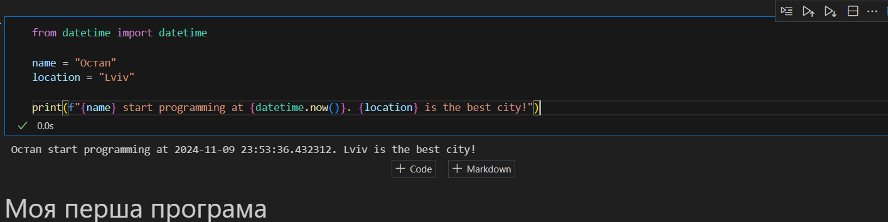

# Звіт до першої лабораторної
## Тема: перша програма на мові *Python*

### Виконання роботи
- Результати виконання завдання:
    1. Виконали першу програму, результат виконання: ;
    1. Модифікували програму та використали [Python Notebook для її виконання](lab1.ipynb);
    
    
    
    1. Програма вивела значення
    1. Отримано наступні результати Остап start programming at 2024-11-09 23:53:04.150002. Lviv is the best city!
    1. Навчились прості програми на мові Python


___


```Python
from datetime import datetime

name = "Остап"
location = "Lviv"

print(f"{name} start programming at {datetime.now()}. {location} is the best city!")

```
